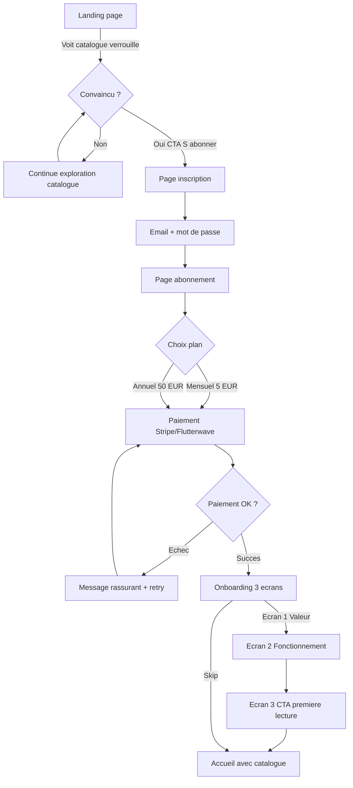
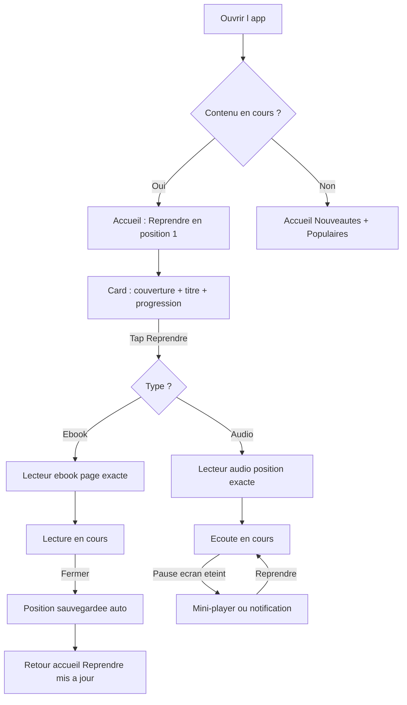
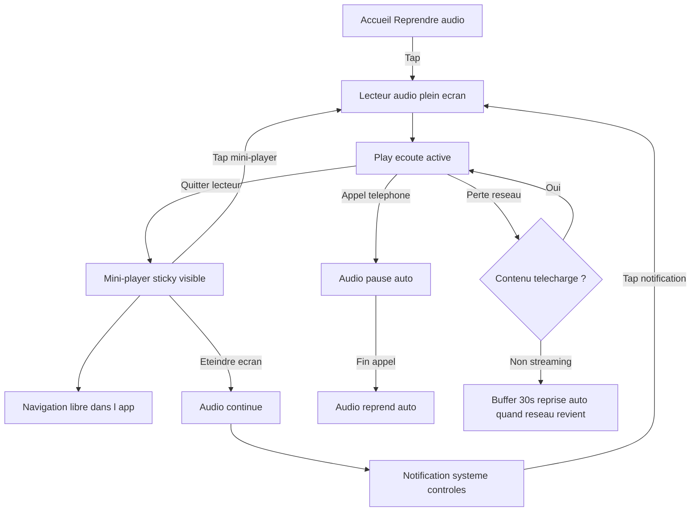
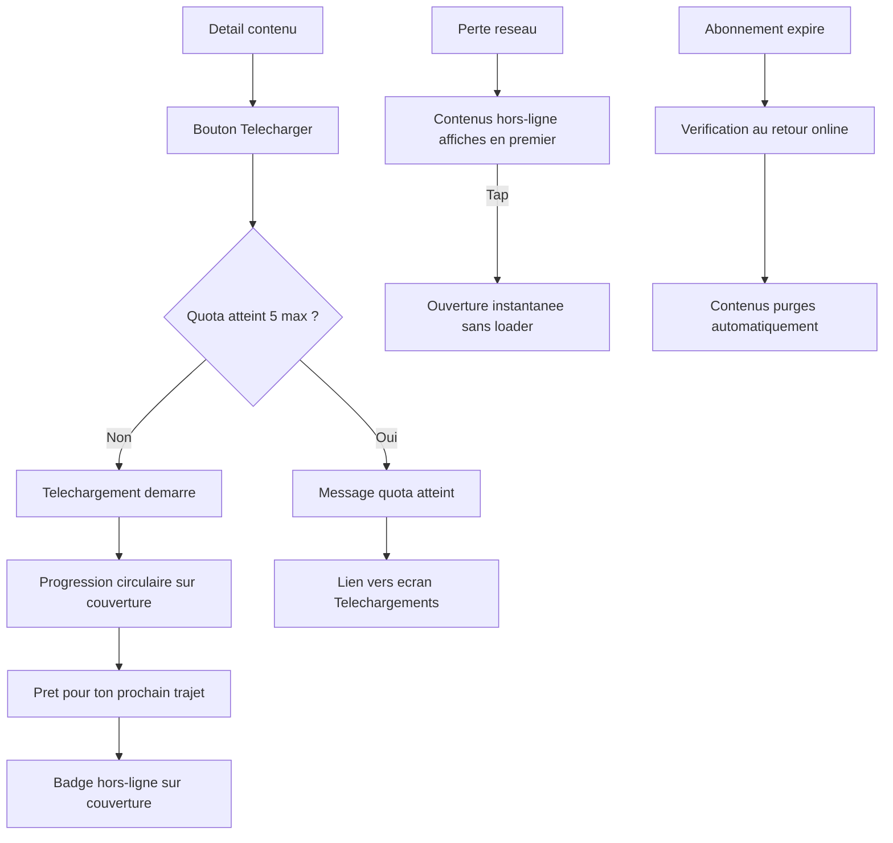
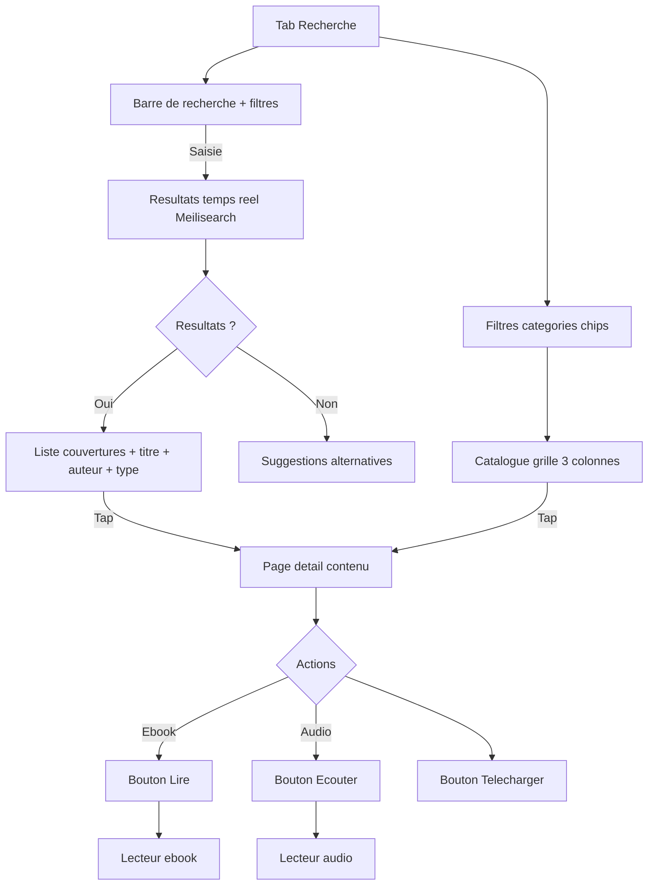
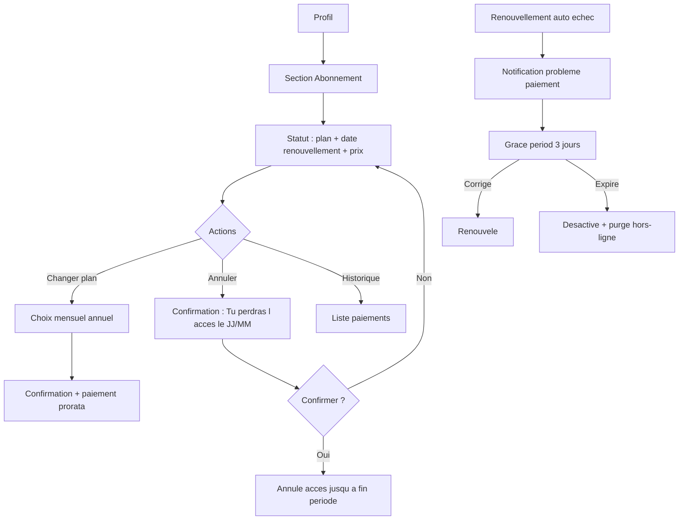

# UX Design Specification — Bibliotheque Numerique Privee

**Auteur:** Patrick
**Date:** 2026-02-07

---

## Executive Summary

### Vision du projet

Bibliotheque numerique privee par abonnement, ciblant les marches africains et la diaspora. Plateforme web (React.js) et mobile (React Native) offrant la lecture d'ebooks (EPUB, PDF), l'ecoute de livres audio (MP3, M4A) et l'acces a des contenus editoriaux exclusifs. Securisation par DRM leger, acces conditionne par abonnement actif (5 EUR/mois ou 50 EUR/an).

Pas un clone d'Audible ou Kindle — une plateforme qui *comprend* son marche : connectivite variable, devices heterogenes, usages reels (bus, cuisine, metro), et une identite culturelle forte.

Inspirations UX : Audible, Scribd, Kobo — adaptees au contexte africain.

### Utilisateurs cibles

Les trois personas sont **egalement prioritaires**. L'interface doit fonctionner en couches : chacun trouve naturellement son niveau.

**Persona 1 — Awa (Etudiante, Afrique urbaine)**
- Android entree de gamme, 3G/4G instable
- Ebooks principalement (manuels, litterature, developpement personnel)
- Mode hors-ligne = condition d'existence sur la plateforme
- Sensibilite prix tres elevee (5 EUR/mois est un engagement significatif)
- Sessions courtes et frequentes (15-40 min), mobile uniquement
- Fonctions cles : surlignage, marque-pages, reprise automatique, mode nuit

**Persona 2 — Franck (Professionnel, diaspora)**
- iPhone haut de gamme, 4G/5G + fibre
- Audio principalement (essais, non-fiction, pendant les trajets)
- Multi-device : iPhone → laptop → tablette, synchronisation transparente
- Exigence UX tres elevee (standards Audible/Spotify)
- Sessions longues audio (30-90 min), sessions ebook moyennes (20-45 min)
- Fonctions cles : playlist, vitesse 1.25x-1.5x, recommandations d'accueil

**Persona 3 — Mariame (Lectrice engagee, Afrique urbaine)**
- Android milieu de gamme, 3G/4G variable
- Mixte ebook + audio (ecoute en arriere-plan pendant taches menageres)
- Mode hors-ligne important (telecharge le soir, consomme la journee)
- Simplicite avant tout — n'explore pas, apprécie ce qui est deja la
- Sessions audio longues (45-120 min en fond), ebook courtes (15-30 min)
- Fonctions cles : reprise automatique, mode nuit, taille police, notifications

### Defis UX cles

**1. Interface unique pour 3 niveaux de maitrise technique**
Awa est a l'aise, Franck est exigeant, Mariame a besoin de simplicite absolue. Solution : hierarchie visuelle limpide avec actions primaires evidentes (Lire / Ecouter / Reprendre) et fonctions avancees accessibles mais jamais en premiere ligne.
> Regle d'or : Si Mariame comprend l'ecran sans explication, alors Franck y trouvera aussi son compte.

**2. Experience reseau degradee — rassurante, jamais punitive**
2/3 des personas operent sur reseau instable. Pas de pages blanches, pas de spinners infinis, pas de messages techniques. Preferer : etats de chargement elegants, contenus caches visuellement distincts, messages rassurants ("Connexion faible — contenu hors-ligne disponible").

**3. Audio en arriere-plan (non negociable)**
Mariame ecoute en cuisinant. Franck ecoute dans le metro. Mini-lecteur persistant type Spotify visible sur toutes les pages. Continuite quand l'ecran est eteint. Controles depuis la notification systeme. Si l'audio s'arrete quand l'ecran s'eteint, le produit echoue pour 2/3 des personas.

**4. Conversion sans essai gratuit**
Pas de freemium, pas d'essai. Landing page tres narrative, apercu catalogue riche mais verrouille, mise en avant des benefices reels (hors-ligne, reprise, audio). L'utilisateur doit se dire : "Je sais exactement ce que je vais payer, et pourquoi."

### Opportunites design

**1. Identite culturelle comme avantage concurrentiel**
Audible est generique, Kindle est americain. Design premium ancre dans la culture africaine — couleurs chaudes, typographies expressives, imagery locale. Pas du folklorique, du premium culturellement ancre. Differenciant fort pour Franck (diaspora).

**2. Mode hors-ligne comme feature hero**
Au lieu de cacher le hors-ligne dans les parametres, en faire un moment UX : "Prepare ta lecture pour le trajet". Bouton clair "Preparer pour plus tard", ecran dedie "Telechargements", compteur visible (contenus telecharges / quota / expiration). C'est un argument de valeur, pas une option technique.

**3. Reprise intelligente comme engagement invisible**
"Reprendre la ou tu t'es arrete" en premiere position sur l'accueil. Synchronisation cross-device transparente. Pattern Spotify/Netflix prouve pour la retention.

### Hierarchie des actions (directive stakeholder)

| Niveau | Actions | Visibilite |
|--------|---------|-----------|
| Primaire (universel) | Lire, Ecouter, Reprendre | Toujours visible, boutons principaux |
| Secondaire | Telecharger, Ajouter playlist, Marque-page | Visible mais secondaire |
| Tertiaire (avance) | Vitesse audio, Surlignage, Reglages fins | Accessible, jamais en premiere ligne |

### Ecrans & flux a designer (13 — valides PRD v1.1)

1. Onboarding (3 ecrans : valeur → fonctionnement → CTA premiere lecture)
2. Inscription / Connexion / Reset password
3. Page d'accueil (Continuer lecture, Nouveautes, Populaires, Recommandations)
4. Catalogue (navigation categories, filtres, recherche)
5. Detail d'un contenu (metadonnees, couverture, actions)
6. Lecteur ebook (EPUB/PDF, marque-pages, surlignage, mode nuit, taille police)
7. Lecteur audio (streaming, vitesse, playlist, reprise, mini-player)
8. Recherche (barre, filtres combines, resultats)
9. Profil utilisateur (infos, historique lecture/ecoute, abonnement, paiements)
10. Page abonnement / paiement (choix plan, Stripe/Flutterwave)
11. Telechargements hors-ligne (gestion, quota, expiration)
12. Notifications (liste, preferences)
13. Back-office (AdminJS — design minimal, impose par contrat)

---

## Core User Experience

### Defining Experience

**Promesse produit :** *"Ouvre l'app, et continue exactement la ou ta vie t'a interrompu."*

**Action coeur : REPRENDRE**

Ce n'est pas "lire" ni "ecouter". C'est **reprendre**. Parce que :
- Awa reprend son chapitre dans le bus apres l'avoir ferme au campus
- Franck reprend son audiobook sur le laptop apres l'avoir ecoute sur l'iPhone
- Mariame reprend son livre audio dans la cuisine apres l'interruption d'un appel

Si la reprise est instantanee et magique, le reste coule naturellement. Si la reprise echoue (mauvaise position, resync ratee, contenu perdu), *tout* le produit echoue.

**Directive stakeholder :** "Reprendre" est l'axe central du design. L'accueil = "Reprendre" en **position absolue numero 1** — avant nouveautes, recommandations, populaires. Si l'utilisateur a un contenu en cours, tout le reste vient apres.

### Effortless Interactions

Interactions qui doivent etre *invisibles* — l'utilisateur ne doit meme pas y penser :

| Interaction | Pourquoi c'est critique | Comment ca doit *se sentir* |
|-------------|------------------------|----------------------------|
| **Reprise de lecture/ecoute** | C'est le coeur du produit | "L'app se souvient de moi" |
| **Synchro cross-device** | Franck change de device 3x/jour | "C'est le meme livre, partout" |
| **Passage online → offline** | Awa perd la 3G dans le bus | "Rien n'a change, je lis toujours" |
| **Audio en arriere-plan** | Mariame ferme l'ecran | "La voix continue, tout simplement" |
| **Renouvellement abonnement** | Webhook silencieux | "Je ne m'en suis meme pas rendu compte" |
| **Chargement du catalogue** | Reseau faible | "Les couvertures arrivent, ca vit" |

**Directive stakeholder — Hors-ligne :** Feedback emotionnel, pas technique. Au lieu de "Telechargement reussi", preferer *"Pret pour ton prochain trajet."*

**Directive stakeholder — Audio :** Mini-player toujours present, jamais intrusif. Il doit exister partout, mais ne jamais voler l'attention au contenu principal.

### Critical Success Moments

Les *instants* ou l'utilisateur decide s'il reste ou s'il part :

**Moment 1 — "Les 30 premieres secondes"**
L'utilisateur ouvre l'app pour la premiere fois apres l'inscription. S'il voit une page d'accueil vivante, avec des couvertures, des suggestions, un bouton "Commencer a lire" — il reste. S'il voit un catalogue vide ou un loader — il part.

**Moment 2 — "La premiere lecture/ecoute"**
Le premier ebook s'ouvre-t-il vite ? Le premier audio demarre-t-il sans coupure ? Ce moment decide la conversion de l'essai mental du visiteur en habitude d'abonne.

**Moment 3 — "Le retour apres 3 jours"**
L'utilisateur revient. L'accueil lui dit "Reprendre *Le monde s'effondre* — Chapitre 3, page 42". Il tape, il reprend. *C'est le moment ou il devient fidele.*

**Moment 4 — "Le premier telechargement hors-ligne"**
Awa telecharge un livre sur le Wi-Fi du campus. Dans le bus, elle ouvre l'app sans reseau. Le livre est la. *C'est le moment ou elle comprend pourquoi elle paie 5 EUR/mois.*

**Moment 5 — "L'audio qui ne s'arrete pas"**
Mariame appuie sur play, pose le telephone, va dans la cuisine. L'ecran s'eteint. La voix continue. *C'est le moment ou l'app devient invisible — le meilleur compliment en UX.*

### Experience Principles

| # | Principe | Application |
|---|----------|------------|
| 1 | **Continuite avant tout** | La reprise, la synchro, le hors-ligne — tout converge vers un seul but : ne jamais interrompre l'utilisateur |
| 2 | **Simplicite visible, profondeur accessible** | L'ecran principal est limpide. Les options avancees existent mais ne polluent pas. Mariame voit 3 boutons, Franck en trouve 10 |
| 3 | **Le reseau n'est jamais un obstacle** | L'app fonctionne. Toujours. Online, offline, 3G, fibre. Pas d'excuses, pas de pages blanches |
| 4 | **Montrer la valeur avant de demander l'argent** | L'apercu, l'onboarding, la landing page — tout dit "voici ce que tu obtiens" avant "voici ce que tu paies" |
| 5 | **L'audio est un citoyen de premiere classe** | Pas un ajout au lecteur ebook. Un lecteur dedie, un mini-player persistant, une experience complete |

### Platform Strategy

| Plateforme | Role | Specificites UX |
|-----------|------|----------------|
| **Web (React.js)** | Decouverte + lecture longue (laptop) | Landing page narrative pour conversion, lecteur ebook plein ecran, recherche avancee |
| **Mobile Android (React Native)** | Usage principal Awa & Mariame | Hors-ligne hero, performance reseau faible, notifications push, audio arriere-plan |
| **Mobile iOS (React Native)** | Usage principal Franck | Qualite premium, multi-device synchro, experience audio Audible-like |
| **Back-office (AdminJS)** | Administration | Design minimal fonctionnel, impose par contrat |

**Responsive / Adaptatif :**
- Web : responsive desktop → tablet → mobile web
- Mobile : design natif React Native (pas de webview pour les ecrans principaux)
- Composants partages quand possible (design system commun)

---

## Desired Emotional Response

### Primary Emotional Goals

**L'emotion dominante : FAMILIARITE**
> L'app n'est pas un outil. C'est un endroit. Un endroit ou tes livres t'attendent, ou ta voix reprend, ou rien n'a bouge depuis ta derniere visite.

| Persona | Emotion primaire | Ce qui la declenche |
|---------|-----------------|-------------------|
| **Awa** | **Securite** — "Mes contenus sont la, meme sans reseau" | Hors-ligne fiable, reprise exacte, pas de surprise |
| **Franck** | **Fluidite** — "Tout fonctionne exactement comme je m'y attends" | Standards Audible/Spotify respectes, synchro transparente, zero friction |
| **Mariame** | **Confort** — "Je n'ai rien a comprendre, ca marche" | Simplicite absolue, reprise automatique, audio qui ne s'arrete pas |

### Emotional Journey Mapping

**1. Decouverte (landing page, avant inscription)**
- **Ressenti desire :** Curiosite + confiance → *"C'est pour moi. Je vois des livres qui me parlent, des auteurs que je connais."*
- **A eviter :** Mefiance ("Encore un service qui ne marchera pas ici"), confusion sur le prix
- **Levier UX :** Catalogue visible mais verrouille, prix affiche clairement, imagery culturelle africaine premium

**2. Inscription + premier lancement**
- **Ressenti desire :** Accueil chaleureux → *"L'app me connait deja un peu. Elle me guide."*
- **A eviter :** Abandon (formulaire trop long), solitude (catalogue vide apres inscription)
- **Levier UX :** Onboarding 3 ecrans (valeur → fonctionnement → premiere lecture), page d'accueil vivante des la premiere seconde

**3. Action coeur (Lire / Ecouter / Reprendre)**
- **Ressenti desire :** Immersion + continuite → *"Je ne pense plus a l'app. Je suis dans le livre."*
- **A eviter :** Rupture (coupure audio, perte de position, loader inattendu)
- **Levier UX :** Reprise instantanee, lecteur performant meme sur reseau faible, mode nuit automatique

**4. Interruption (reseau coupe, ecran eteint, changement de device)**
- **Ressenti desire :** Serenite → *"Pas de panique. L'app gere."*
- **A eviter :** Anxiete ("J'ai perdu ma position ?"), frustration ("Pourquoi ca s'est arrete ?")
- **Levier UX :** Audio continue en arriere-plan, hors-ligne transparent, message rassurant ("Connexion faible — contenu hors-ligne disponible")

**5. Retour (reouverture apres heures/jours)**
- **Ressenti desire :** Reconnaissance → *"L'app se souvient de moi. Reprendre exactement la."*
- **A eviter :** Desorientation ("Ou j'en etais ?"), impression de repartir a zero
- **Levier UX :** "Reprendre" en position #1, couverture + progression visuelle, notification douce "Tu en etais au chapitre 7"

### Micro-Emotions

| Paire emotionnelle | Cible | Ce qui fait basculer |
|-------------------|-------|---------------------|
| **Confiance** vs. Scepticisme | Confiance | Prix clair, pas de frais caches, contenu reellement disponible hors-ligne |
| **Accomplissement** vs. Frustration | Accomplissement | Progression visible (% lu, chapitres), historique de lecture qui grandit |
| **Appartenance** vs. Isolement | Appartenance | Identite culturelle du design, catalogue qui reflete l'utilisateur, "Pour nous, par nous" |
| **Tranquillite** vs. Anxiete | Tranquillite | Pas de messages d'erreur techniques, pas de "connexion perdue", etat hors-ligne naturel |
| **Plaisir** vs. Indifference | Plaisir | Micro-animations couvertures, transitions fluides, feedback emotionnel ("Pret pour ton prochain trajet") |
| **Autonomie** vs. Dependance | Autonomie | L'utilisateur controle ses telechargements, sa vitesse audio, sa taille de police — sans qu'on lui impose |

### Design Implications

| Emotion cible | Approche UX |
|--------------|------------|
| **Familiarite** | Accueil personnalise, "Reprendre" dominant, couvertures des livres en cours en grand |
| **Securite (Awa)** | Indicateur hors-ligne visible, compteur de contenus telecharges, confirmation emotionnelle de telechargement |
| **Fluidite (Franck)** | Transitions zero-friction, mini-player type Spotify, synchro silencieuse cross-device |
| **Confort (Mariame)** | Taille police reglable, mode nuit, audio en un tap depuis l'accueil, zero menu superflu |
| **Confiance** | Prix affiche partout (pas de surprise), statut abonnement clair dans le profil, pas de dark patterns |
| **Appartenance** | Palette de couleurs chaudes, typographies expressives, imagery africaine contemporaine — premium, pas folklorique |

### Emotional Design Principles

| # | Principe | Application concrete |
|---|----------|---------------------|
| 1 | **"L'app se souvient de toi"** | Chaque retour commence par la reprise. L'historique est visible. La progression est fiere. |
| 2 | **"Rien ne casse"** | Reseau, hors-ligne, ecran eteint — l'experience continue. Pas de messages d'erreur qui font peur. |
| 3 | **"C'est chez toi"** | Design culturellement ancre. L'utilisateur se reconnait dans l'interface. Pas une traduction d'un produit americain. |
| 4 | **"Tu controles"** | Vitesse audio, taille police, mode nuit, telechargements — l'utilisateur choisit, l'app s'adapte. |
| 5 | **"Chaque euro compte"** | La valeur est evidente. Le catalogue est riche. Le hors-ligne fonctionne. L'abonnement se justifie tous les jours. |

---

## UX Pattern Analysis & Inspiration

### Inspiring Products Analysis

**1. Audible (Amazon) — Reference audio**

| Aspect | Ce qu'ils font bien | Ce qu'on garde |
|--------|---------------------|----------------|
| **Lecteur audio** | Vitesse variable, sleep timer, marque-pages audio, mini-player | Tout. C'est le standard. Franck s'attend a exactement ca. |
| **Reprise** | Synchro Whispersync entre devices, reprise instantanee | Pattern fondamental — c'est notre action coeur #1 |
| **Navigation** | Bibliotheque personnelle dominante, accueil = "Continue Listening" | Exactement notre approche "Reprendre en position absolue #1" |
| **Onboarding** | Essai gratuit 30 jours + 1 credit | On n'a pas d'essai → on doit compenser par une landing page plus convaincante |

**2. Spotify — Reference experience audio en arriere-plan**

| Aspect | Ce qu'ils font bien | Ce qu'on garde |
|--------|---------------------|----------------|
| **Mini-player** | Barre persistante en bas, visible sur toutes les pages, tap pour agrandir | Exactement notre directive : toujours present, jamais intrusif |
| **Mode hors-ligne** | Telecharger d'un tap, indicateur vert visible, compteur d'espace | Notre "feature hero" hors-ligne — feedback emotionnel + indicateur visible |
| **Transitions** | Fluides, micro-animations, aucune page blanche | Standard pour Franck. Adapte pour reseau faible (Awa, Mariame) |
| **Controles notification** | Play/pause/skip depuis la barre de notification systeme | Non negociable pour l'audio en arriere-plan |

**3. Kobo — Reference lecteur ebook**

| Aspect | Ce qu'ils font bien | Ce qu'on garde |
|--------|---------------------|----------------|
| **Lecteur EPUB** | Taille police, mode nuit, marges, interligne, polices personnalisees | Fonctions essentielles pour les 3 personas |
| **Surlignage** | Couleurs multiples, notes associees, export | MVP = surlignage basique. Suffisant pour Awa. |
| **Progression** | % de progression, temps de lecture estime, chapitres restants | Engagement invisible — nourrit le sentiment d'accomplissement |
| **Catalogue** | Grille couvertures, categories claires, recherche efficace | Design catalogue propre, adapte a notre identite culturelle |

**4. Netflix — Reference reprise & personnalisation (hors categorie)**

| Aspect | Ce qu'ils font bien | Ce qu'on garde |
|--------|---------------------|----------------|
| **"Continue Watching"** | En position #1 absolue sur l'accueil | Notre "Reprendre" suit exactement ce pattern |
| **Couvertures vivantes** | Hover animations, apercu video | Equivalent : couvertures avec barre de progression, micro-animation au tap |
| **Profil simple** | Un tap pour changer, pas de configuration complexe | Simplicite pour Mariame |
| **Reseau adaptatif** | Qualite auto-ajustee selon la connexion | Notre strategie reseau degrade — compression adaptative |

### Transferable UX Patterns

**Patterns de navigation :**

| Pattern | Source | Application Bibliotheque Numerique |
|---------|--------|----------------------------------|
| **Tab bar fixe (4-5 items)** | Spotify, Audible | Accueil / Catalogue / Recherche / Telechargements / Profil |
| **"Continue" en hero position** | Netflix, Audible | Carrousel horizontal "Reprendre" en haut de l'accueil |
| **Mini-player sticky bottom** | Spotify | Au-dessus de la tab bar, visible partout, tap pour plein ecran |
| **Pull-to-refresh** | Standard mobile | Rafraichissement du catalogue et des recommandations |

**Patterns d'interaction :**

| Pattern | Source | Application Bibliotheque Numerique |
|---------|--------|----------------------------------|
| **Swipe-to-download** | Spotify | Geste rapide pour telecharger un contenu hors-ligne |
| **Long press → options** | iOS/Android natif | Marque-page, ajouter playlist, partager — actions secondaires |
| **Skeleton loading** | Facebook, Kobo | Formes de couvertures grises qui se remplissent — jamais de page blanche |
| **Bottom sheet (actions)** | Google Maps, Spotify | Detail d'un contenu, options lecteur — glisser vers le haut |

**Patterns visuels :**

| Pattern | Source | Application Bibliotheque Numerique |
|---------|--------|----------------------------------|
| **Couvertures en grille 2-3 colonnes** | Kobo, Kindle | Catalogue et bibliotheque personnelle |
| **Barre de progression sur couverture** | Kindle, Audible | Reprise visuelle instantanee — l'utilisateur voit ou il en est |
| **Mode sombre natif** | Kobo, Spotify | Mode nuit automatique ou manuel — confort de lecture |
| **Couleurs chaudes + typo expressive** | Identite culturelle propre | Notre differenciant — pas de copie Audible/Kindle |

### Anti-Patterns to Avoid

| Anti-pattern | Ou on le voit | Pourquoi l'eviter |
|-------------|---------------|-------------------|
| **Paywall brutal sans apercu** | Apps generiques | Tue la confiance. Notre landing doit montrer le catalogue *avant* de demander l'argent |
| **Spinner infini sur reseau lent** | Apps non optimisees Afrique | 2/3 de nos personas sont sur reseau instable. Skeleton loading obligatoire. |
| **Audio qui s'arrete avec l'ecran** | Apps mal implementees | Produit mort pour Mariame et Franck. Audio background = non negociable. |
| **Recherche sans resultats = page vide** | Mauvais e-commerce | Toujours proposer des alternatives : "Pas de resultats pour X — essayez Y" |
| **Onboarding de 7 ecrans** | Apps enterprise | 3 ecrans max. Valeur → Fonctionnement → CTA. Pas plus. |
| **Menu hamburger cache** | Design web ancien | Tab bar visible en permanence. Les fonctions principales ne se cachent jamais. |
| **Telechargement sans feedback** | Apps reseau | L'utilisateur doit *sentir* que le contenu est pret ("Pret pour ton prochain trajet") |
| **Messages d'erreur techniques** | Apps developpeurs | Jamais "Error 503". Toujours "Connexion faible — contenu hors-ligne disponible" |

### Design Inspiration Strategy

**ADOPTER tel quel :**
- Mini-player sticky Spotify → pour l'audio persistant
- "Continue Listening/Reading" Netflix en position #1 → pour "Reprendre"
- Skeleton loading Facebook → pour le reseau degrade
- Controles audio notification systeme → pour l'audio en arriere-plan

**ADAPTER a notre contexte :**
- Lecteur Kobo → simplifie pour Mariame (moins d'options en surface), complet pour Franck (options accessibles)
- Onboarding Audible → sans essai gratuit, donc plus narratif, plus visuel, plus convaincant
- Catalogue Kobo/Kindle → avec identite visuelle africaine, couvertures plus grandes, couleurs chaudes
- Mode hors-ligne Spotify → avec feedback emotionnel au lieu de technique

**EVITER absolument :**
- Complexite Kindle (trop de menus, trop de settings en surface)
- Genericite visuelle Audible (notre design doit etre culturellement ancre)
- Dark patterns d'abonnement (renouvellement cache, annulation difficile)
- Dependance reseau de la plupart des apps occidentales

---

## Design System Foundation

### Design System Choice

**Approche hybride : MUI (Web) + React Native Paper (Mobile) + Tokens partages**

| Couche | Web (React.js) | Mobile (React Native) |
|--------|----------------|----------------------|
| **Composants UI** | MUI (Material UI v5+) | React Native Paper |
| **Theming** | MUI Theme Provider | React Native Paper Theme |
| **Tokens partages** | Fichier JSON commun : couleurs, typo, espacements, ombres |
| **Icones** | Material Icons + icones custom (SVG) | Material Community Icons + custom |
| **Navigation** | React Router | React Navigation |

### Rationale for Selection

| Facteur | Realite projet | Pourquoi MUI + RN Paper |
|---------|----------------|------------------------|
| **Budget** | 3 300 EUR total | Zero cout de licence, communaute massive |
| **Timeline** | 3-4.5 mois | 80% des composants prets a l'emploi |
| **Plateformes** | React.js + React Native | Meme langage visuel Material Design, theme partage |
| **Performance Android** | Devices entree/milieu de gamme | Material Design est natif Android — optimise pour Awa et Mariame |
| **Identite culturelle** | Design premium africain | Theme custom transforme le Material generique en identite unique |
| **Equipe** | Petite equipe, execution rapide | Documentation excellente, patterns prouves |

Options eliminees :
- **Custom Design System** : 3-6 semaines de construction incompatibles avec budget et timeline
- **Tailwind UI + NativeWind** : Plus de liberte visuelle mais plus de travail composant, moins de pre-fait

### Customization Strategy

**Tokens design (fichier partage JSON) :**

| Token | Valeur |
|-------|--------|
| **Primary** | Ton chaud (terre/ocre africain) — pas le bleu Material Design par defaut |
| **Secondary** | Accent dore/ambre |
| **Background clair** | Creme chaud |
| **Background sombre** | Noir profond (mode nuit) |
| **Surface** | Blanc casse / gris tres chaud |
| **Error** | Rouge doux, pas agressif |
| **Success** | Vert naturel |
| **Titres** | Police expressive (serif ou semi-serif moderne) |
| **Corps** | Police lisible, optimisee petit ecran (sans-serif, 15-16px min) |
| **Border radius** | Genereux (12-16px cards) — chaleur, accueil |
| **Ombres** | Douces et chaudes (pas de drop-shadow froide) |
| **Zones tactiles** | 48px minimum sur mobile |

**Composants custom a creer (pas dans MUI/RN Paper) :**

| Composant | Raison |
|-----------|--------|
| **Mini-player audio** | Barre sticky Spotify-like — n'existe pas dans MUI |
| **Lecteur ebook** | epub.js + interface custom (taille police, mode nuit, surlignage) |
| **Lecteur audio plein ecran** | Controles vitesse, sleep timer, chapitres |
| **Card contenu avec progression** | Couverture + barre de progression + badge hors-ligne |
| **Indicateur hors-ligne** | Badge/chip montrant le statut telechargement |
| **Onboarding carousel** | 3 ecrans avec illustrations, swipe, dots, CTA |

### Implementation Approach

**Phase 1 — Tokens & Theme (semaine 1)**
- Definir les tokens partages (JSON)
- Configurer MUI Theme Provider (web)
- Configurer RN Paper Theme (mobile)
- Valider la coherence visuelle sur les 2 plateformes

**Phase 2 — Composants de base (semaine 1-2)**
- Boutons, cards, listes, navigation — utiliser MUI/RN Paper tels quels, themes
- Bottom sheet, dialogs, snackbars — composants Material natifs

**Phase 3 — Composants custom (semaine 2-4)**
- Mini-player audio
- Lecteur ebook
- Lecteur audio plein ecran
- Cards contenu avec progression
- Onboarding carousel

---

## Defining Core Experience

### Defining Experience

**Phrase que les utilisateurs disent a leurs amis :**

> *"Tu ouvres l'app, et tu reprends exactement la ou tu t'es arrete — meme si tu as change de telephone."*

Fusion de Netflix ("Continue Watching") + Spotify (audio everywhere) + Kindle (offline reading) — ancree dans un contexte ou le reseau n'est pas garanti.

### User Mental Model

**Attentes transferees par persona :**

| Persona | Modele mental existant | Attente transferee | Risque de confusion |
|---------|----------------------|-------------------|-------------------|
| **Awa** | WhatsApp (fonctionne toujours, meme en 3G), PDF telecharges | "Ca doit marcher meme quand j'ai pas de reseau" | Si le hors-ligne n'est pas evident, elle pense que l'app ne fonctionne pas |
| **Franck** | Audible + Spotify (standards premium, multi-device) | "Je change de device, ca suit" | Si la synchro cross-device a un delai visible, il perd confiance |
| **Mariame** | Radio FM (audio en fond, zero interaction), WhatsApp vocal | "J'appuie play, je pose, ca continue" | Si l'audio s'arrete ou demande une interaction, elle abandonne |

**Solutions actuelles et leurs limites :**

| Solution actuelle | Ce qu'ils aiment | Ce qu'ils detestent | Notre avantage |
|------------------|-----------------|---------------------|----------------|
| **PDF telecharges** | Gratuit, hors-ligne | Pas de reprise, pas de marque-pages, pas d'audio | Reprise + marque-pages + audio + legal |
| **YouTube (audio)** | Gratuit, vaste | Consomme data, pas d'arriere-plan gratuit, publicites | Audio offline, arriere-plan, zero pub |
| **Audible** | Qualite premium | Pas de catalogue africain, prix USD, pas adapte Afrique | Catalogue local, prix EUR adapte, reseau degrade |
| **Livres physiques** | Pas besoin de device | Cher, lourd, pas audio | Tout dans la poche, audio + ebook |

### Success Criteria

| Critere | Mesure | Seuil de succes |
|---------|--------|----------------|
| **Vitesse de reprise** | Temps entre "ouvrir l'app" et "etre dans le contenu" | < 3 secondes (online), < 2 secondes (hors-ligne) |
| **Precision de position** | Position exacte dans le livre/audio | Page exacte (ebook), ±5 secondes (audio) |
| **Synchro cross-device** | Delai entre fermer sur device A et reprendre sur device B | < 10 secondes en conditions normales |
| **Continuite hors-ligne** | Le contenu telecharge s'ouvre sans accroc | Zero message d'erreur, zero loader |
| **Audio en arriere-plan** | L'audio continue ecran eteint / app en fond | Aucune interruption pendant 2h continues |
| **Reprise apres interruption** | Appel telephone, notification, changement d'app | Reprise automatique a la position exacte |

**L'utilisateur dit "ca marche" quand :** il n'a aucune conscience de la technologie derriere. Il ouvre, il lit/ecoute, il ferme. Le lendemain, il ouvre, il continue. C'est tout.

### Novel UX Patterns

**Patterns etablis adoptes (zero education) :**

| Pattern | Source | Application |
|---------|--------|------------|
| "Continue Watching/Listening" en hero | Netflix, Spotify, Audible | Carrousel "Reprendre" en #1 sur l'accueil |
| Mini-player sticky | Spotify | Audio persistant au bas de chaque ecran |
| Swipe/tap pour telecharger | Spotify | Icone fleche → telechargement hors-ligne |
| Barre de progression sur couverture | Kindle, Audible | Indication visuelle de ou on en est |
| Tab bar fixe | Standard mobile | Navigation principale toujours visible |

**Innovation contextuelle (pattern familier, contexte nouveau) :**

| Innovation | Pattern familier | Notre twist |
|-----------|-----------------|------------|
| **Feedback emotionnel hors-ligne** | Notification de succes standard | "Pret pour ton prochain trajet" au lieu de "Telechargement termine" |
| **Accueil adaptatif reseau** | Loading states standards | Si reseau faible : contenus hors-ligne en premier, online en skeleton loading |
| **Reprise multi-format** | Whispersync Audible (ebook↔audio) | Meme livre, passage lecture → ecoute au meme point (si les 2 formats existent) |

### Experience Mechanics

**1. Initiation — Declenchement de "Reprendre"**

L'accueil affiche en position #1 la section "Reprendre" avec card(s) contenu en cours : couverture, titre, progression %, bouton Reprendre. Awa voit son ebook avec la page exacte, Franck voit son audiobook avec le temps restant, Mariame voit son audio avec un seul tap pour reprendre en arriere-plan.

**2. Interaction — Lecture/Ecoute active**

Lecteur ebook : page instantanee a la position sauvegardee, swipe pour tourner, tap centre pour barre d'outils (taille police, mode nuit, marque-page, surlignage), progression sauvegardee toutes les 30 secondes en background, fonctionnement identique hors-ligne avec synchro a la reconnexion.

Lecteur audio : play instantane a la position sauvegardee, controles play/pause, -15s/+30s, vitesse, chapitres, mini-player quand on quitte le plein ecran, audio continue ecran eteint + notification systeme avec controles, progression sauvegardee en continu.

**3. Feedback — Signaux de reussite**

| Moment | Feedback |
|--------|---------|
| Ouverture contenu | Barre de progression se remplit, page/position correcte |
| Pendant lecture | Numero de page, % progression en haut |
| Pendant ecoute | Timer decompte, barre progression audio, chapitre courant |
| Marque-page ajoute | Micro-animation + confirmation subtile |
| Telechargement lance | Progression circulaire sur couverture → "Pret pour ton trajet" |
| Synchro cross-device | Invisible — position juste correcte |
| Hors-ligne actif | Petit badge/icone sur contenus disponibles offline |

**4. Completion — Fin de contenu**

Ecran "Termine!" avec couverture, statistiques (temps total, date debut/fin), recommandations de contenus similaires, contenu suivant dans la playlist si applicable. Ajout automatique a l'historique de lecture, progression 100% visible dans la bibliotheque.

---

## Visual Design Foundation

### Color System

**Philosophie :** Premium culturellement ancre. Couleurs chaudes, terreuses, naturelles. Equilibre entre modernite et ancrage africain.

**Palette principale :**

| Role | Nom | Hex | Inspiration |
|------|-----|-----|------------|
| **Primary** | Terre d'Afrique | `#B5651D` | Ocre/terre — chaleur, enracinement, authenticite |
| **Primary Dark** | Cacao profond | `#7A3B10` | Variante sombre pour contraste |
| **Primary Light** | Sable dore | `#D4A574` | Variante claire pour backgrounds, hover |
| **Secondary** | Or du Sahel | `#D4A017` | Ambre/or — richesse, valeur, premium |
| **Secondary Light** | Miel clair | `#F0D68A` | Accents doux, badges |
| **Accent** | Indigo Adire | `#2E4057` | Bleu profond textile — modernite, confiance |

**Surfaces :**

| Role | Mode clair | Mode sombre |
|------|-----------|-------------|
| **Background** | `#FBF7F2` Creme chaud | `#1A1A1A` Noir profond |
| **Surface** | `#FFFFFF` Blanc | `#2D2D2D` Gris charbon |
| **Surface variant** | `#F5EDE4` Sable tres clair | `#3A3A3A` Gris moyen |
| **On Background** | `#2C1810` Brun tres fonce | `#F5EDE4` Sable clair |
| **On Surface** | `#3D2B1F` Brun fonce | `#E8DDD0` Creme |

**Semantiques :**

| Role | Couleur | Usage |
|------|---------|-------|
| **Success** | `#4A7C59` Vert foret | Telechargement OK, "Pret pour ton trajet" |
| **Warning** | `#D4A017` Or (= secondary) | Abonnement expire bientot, quota 80% |
| **Error** | `#C25450` Rouge brique doux | Erreur paiement (rare, jamais agressif) |
| **Info** | `#2E4057` Indigo (= accent) | Messages informatifs, tooltips |

### Typography System

**Polices :**

| Role | Police | Fallback | Justification |
|------|--------|----------|---------------|
| **Titres (H1-H3)** | **Playfair Display** | Georgia, serif | Serif elegante, caractere premium. Google Fonts, gratuite. |
| **Corps (Body/UI)** | **Inter** | -apple-system, sans-serif | Sans-serif moderne, excellente lisibilite petits ecrans. Google Fonts, gratuite. |
| **Monospace** | **JetBrains Mono** | Menlo, monospace | Back-office uniquement |

**Echelle typographique (base 16px, ratio 1.25) :**

| Token | Taille | Poids | Interligne | Usage |
|-------|--------|-------|-----------|-------|
| **display** | 32px / 2rem | 700 Bold | 1.2 | Titres onboarding, hero landing |
| **h1** | 26px / 1.625rem | 700 Bold | 1.25 | Titre de page |
| **h2** | 21px / 1.3125rem | 600 Semi-Bold | 1.3 | Titre de section |
| **h3** | 17px / 1.0625rem | 600 Semi-Bold | 1.35 | Sous-titres, categories |
| **body** | 16px / 1rem | 400 Regular | 1.5 | Texte principal |
| **body-small** | 14px / 0.875rem | 400 Regular | 1.45 | Texte secondaire, metadonnees |
| **caption** | 12px / 0.75rem | 400 Regular | 1.4 | Labels, timestamps, badges |
| **button** | 16px / 1rem | 600 Semi-Bold | 1 | Texte des boutons |

**Regles :** Taille minimum corps mobile 15px. Taille ajustable dans le lecteur ebook (14-24px). Playfair Display uniquement pour titres. Inter pour toute l'interface.

### Spacing & Layout Foundation

**Systeme d'espacement (base 8px) :**

| Token | Valeur | Usage |
|-------|--------|-------|
| **xs** | 4px | Micro-gaps, espacement interne icones |
| **sm** | 8px | Elements proches (icone + label) |
| **md** | 16px | Padding cards, gap entre cards |
| **lg** | 24px | Marge entre sections |
| **xl** | 32px | Padding page, separation majeure |
| **2xl** | 48px | Espacement entre blocs principaux |

**Zones tactiles :** Minimum 48x48px mobile. Boutons principaux hauteur 48px, padding horizontal 24px.

**Grille :**

| Plateforme | Colonnes | Gouttiere | Marges |
|-----------|---------|-----------|--------|
| **Mobile** | 4 colonnes | 16px | 16px |
| **Tablet** | 8 colonnes | 24px | 24px |
| **Desktop** | 12 colonnes | 24px | max-width 1200px, centre |

**Formes :**

| Element | Border radius |
|---------|--------------|
| Boutons | 24px (pill shape) |
| Cards | 12px |
| Inputs | 8px |
| Avatars | 50% (cercle) |
| Mini-player | 0px (bord a bord) |
| Bottom sheet | 16px top |

**Layout principles :** Mobile-first. Couvertures ratio 2:3 constant. Cards avec ombre douce et chaude.

### Accessibility Considerations

| Exigence | Standard | Implementation |
|----------|---------|----------------|
| **Contraste texte** | WCAG AA (4.5:1) | Tous les couples couleur/fond verifies |
| **Contraste grands textes** | WCAG AA (3:1) | H1, H2, display |
| **Taille police min** | 15px mobile, 14px desktop | Token body-small = plancher |
| **Zones tactiles** | 48x48px minimum | Tous elements interactifs |
| **Mode sombre** | Contrastes reverifies | Palette dediee, pas un simple inverse |
| **Lecteur ebook** | Taille ajustable 14-24px | Controle utilisateur direct |
| **Daltonisme** | Icones + couleur pour les etats | Ne pas s'appuyer sur la couleur seule |
| **Navigation clavier** | Focus visible (web) | Outline sur tous les interactifs |

---

## Design Direction Decision

### Design Directions Explored

4 directions explorees via mockups HTML interactifs (`planning-artifacts/ux-design-directions.html`) :

- **Direction A — Immersive Chaleureuse :** Fond creme chaud, palette terre/ocre, "Reprendre" en hero avec grande couverture, mini-player integre. Identite culturelle forte, Awa + Mariame a l'aise.
- **Direction B — Epuree Moderne :** Fond blanc, densite minimale, salutation personnalisee, filtres chips, grille 3 colonnes. Clarte, lisibilite, performance reseau faible.
- **Direction C — Immersive Sombre :** Mode sombre par defaut, hero gradient, couvertures larges, mini-player gradient premium. Streaming type Netflix, ideal sessions nocturnes.
- **Direction D — Card-Centric :** Grande card hero pour "Reprendre", liste ordonnee classement, approche editoriale. Magazine digital haut de gamme.

### Chosen Direction

**Fusion A+B — Chaleureuse & Epuree** (choix stakeholder)

| Element | Source | Application |
|---------|--------|------------|
| **Fond** | A | Creme chaud `#FBF7F2` — pas le blanc froid de B |
| **Densite** | B | Espacement genereux, respiration entre les elements |
| **Salutation** | B | "Bonjour, Awa" en haut — familiarite personnalisee |
| **"Reprendre"** | A | Card hero avec couverture + progression + bouton, style epure de B (moins d'ombre, plus de blanc) |
| **Mini-player** | A | Toujours present en bas — non negociable |
| **Catalogue** | B | Filtres chips horizontaux + grille propre |
| **Couvertures** | Mix | Carrousel horizontal de A pour l'accueil, grille 3 colonnes de B pour le catalogue |
| **Typographie** | A | Playfair Display titres (identite culturelle) avec espacement aere de B |
| **Mode sombre** | A adapte | Palette sombre dediee (noirs profonds + ocre doux) — switcher, pas par defaut |

### Design Rationale

- A donne la chaleur et l'identite culturelle (fond creme, palette terre, Playfair Display)
- B donne la respiration et la clarte (espacement, densite reduite, filtres chips)
- Mariame comprend sans explication (simplicite de B)
- Franck apprecie le soin du detail (proprete de B + chaleur de A)
- Awa voit l'essentiel tout de suite (hierarchie limpide)

Elements ecartes : fond blanc froid de B (on garde creme chaud de A), densite de A dans les sections secondaires (on adopte l'aeration de B), absence de mini-player de B (on garde celui de A).

### Implementation Approach

1. Mode clair = base de travail (Direction A+B)
2. Mode sombre = adaptation de la palette (noirs profonds + ocre doux), pas un simple inverse
3. Accueil mobile : salutation personnalisee (B) → card "Reprendre" hero (A) → carrousel nouveautes (A) → mini-player (A)
4. Catalogue : chips filtres (B) + grille 3 colonnes (B) sur fond creme (A)
5. Lecteurs : immersifs, plein ecran, mode nuit integre

---

## User Journey Flows

### Parcours 1 — Decouverte → Inscription → Premier contenu

Le flux de conversion visiteur → abonne actif, sans essai gratuit.

Points cles : landing narrative avec catalogue verrouille, prix clair, inscription email+mdp, paiement immediat, onboarding 3 ecrans skippables, accueil vivant.

### Parcours 2 — Reprendre (action coeur)

Le flux quotidien de 100% des utilisateurs.

Regles : < 3s online, < 2s hors-ligne, sauvegarde toutes les 30s, synchro cross-device < 10s.

### Parcours 3 — Ecoute audio en arriere-plan

Le flux de Mariame (cuisine) et Franck (metro).

Non negociable : audio continue ecran eteint, mini-player sur toutes les pages, controles notification systeme, pause/reprise auto sur appel.

### Parcours 4 — Telechargement hors-ligne

Le flux "feature hero" pour Awa.

Regles : max 5 contenus, TTL 72h, AES 256, purge si abonnement expire, feedback emotionnel.

### Parcours 5 — Recherche → Lecture

Le flux d'exploration du catalogue.

### Parcours 6 — Gestion abonnement

Le flux sensible — confiance et transparence.

### Journey Patterns

| Pattern | Application | Ecrans concernes |
|---------|------------|-----------------|
| **Skeleton loading** | Formes grises qui se remplissent, jamais de page blanche | Accueil, Catalogue, Recherche |
| **Pull-to-refresh** | Rafraichissement contenu en tirant vers le bas | Accueil, Catalogue, Telechargements |
| **Bottom sheet** | Actions secondaires (marque-page, playlist, partager) | Detail contenu, Lecteur |
| **Long press** | Acces rapide aux options | Cards couvertures |
| **Snackbar/Toast** | Feedback non-bloquant | "Pret pour ton trajet", "Marque-page ajoute" |
| **Etat vide illustre** | Illustration + CTA quand section vide | Telechargements, Playlist, Recherche 0 resultat |

### Flow Optimization Principles

| Principe | Application |
|----------|------------|
| **Minimum de taps vers la valeur** | Ouvrir → Reprendre = 1 tap |
| **Pas de cul-de-sac** | Chaque ecran propose une action suivante ou retour clair |
| **Erreurs = opportunites** | Connexion faible → contenus hors-ligne. Aucun resultat → suggestions. |
| **Progressive disclosure** | Options avancees cachees derriere un tap supplementaire |
| **Feedback immediat** | Chaque action a une reponse visuelle en < 200ms |

---

## Component Strategy

### Design System Components

17 composants disponibles via MUI (web) + React Native Paper (mobile), themes avec tokens partages :

| Composant | Usage Bibliotheque Numerique |
|-----------|------------------------------|
| **Button** | Lire, Ecouter, Reprendre, Telecharger, S'abonner |
| **Card** | Cards couvertures catalogue, cards "Reprendre" |
| **AppBar** | Barre superieure avec titre + avatar |
| **Bottom Navigation** | Tab bar 5 items (Accueil, Catalogue, Recherche, Hors-ligne, Profil) |
| **TextField / TextInput** | Recherche, inscription, connexion |
| **Chip** | Filtres categories catalogue |
| **Dialog** | Confirmation annulation, suppression |
| **Snackbar** | Feedback : "Marque-page ajoute", "Pret pour ton trajet" |
| **Progress Bar** | Progression lecture/telechargement |
| **List** | Historique paiements, playlists, notifications |
| **Divider** | Separateurs sections |
| **Switch** | Preferences notifications, mode nuit |
| **Menu** | Options avancees lecteur |
| **FAB** | Action rapide (optionnel) |
| **Badge** | Notifications non lues, contenus telecharges |
| **Icon** | Navigation, actions, etats |
| **Skeleton** | Loading states reseau faible (MUI natif, custom RN) |

### Custom Components

**7 composants custom a construire :**

#### 1. Mini-Player Audio
Controle audio persistant visible sur toutes les pages, pattern Spotify. Position sticky au-dessus de tab bar (bottom 56px), hauteur 64px. Contenu : couverture miniature 40x40px + titre + auteur + play/pause + suivant. Etats : playing (barre progression animee), paused, loading (spinner), hors-ligne (badge). Tap ouvre lecteur plein ecran.

#### 2. Lecteur Ebook
Lecture immersive EPUB/PDF. Plein ecran, barre d'outils masquee par defaut (tap centre pour afficher). Reglages : taille police 14-24px, mode nuit toggle, interligne. Surlignage : selection texte → popup (couleur unique MVP). Navigation swipe (EPUB), scroll (PDF), table des matieres. Progression : barre + % + pages restantes dans le chapitre.

#### 3. Lecteur Audio Plein Ecran
Experience ecoute type Audible. Couverture large 60% ecran + titre + auteur + controles. Controles principaux : play/pause 64px, -15s, +30s. Controles secondaires : vitesse 0.5x-2x, sleep timer, chapitres (bottom sheet), playlist. Barre progression scrubable + temps ecoule/total.

#### 4. Card Contenu avec Progression
Representer un livre/audio avec etat de lecture. Couverture ratio 2:3 + titre + auteur + badge type. Barre progression sous couverture si contenu en cours. Badges : hors-ligne (vert), nouveau (secondary), audio (casque). 3 variants : horizontal (carrousel, 200px), vertical (grille, 120px), liste (full width). Tap → detail, long press → bottom sheet options.

#### 5. Indicateur Hors-ligne
Badge sur couverture (coin bas-droit, 24x24px). Etats : telecharge (checkmark vert), en cours (progression circulaire), non telecharge (absent). Animation de completion + snackbar "Pret pour ton prochain trajet".

#### 6. Onboarding Carousel
3 ecrans premier lancement. Layout : illustration 50% + titre Playfair + description Inter + CTA. Navigation swipe horizontal + dots + "Suivant" + "Passer" (skip). Ecrans : valeur → fonctionnement → CTA premiere lecture.

#### 7. Barre de Recherche avec Filtres
Input pleine largeur + icone + chips filtres dessous. Resultats temps reel apres 2 caracteres (debounce 300ms). Etat vide : "Aucun resultat pour X — essaye Y" + suggestions.

### Component Implementation Strategy

| Priorite | Composants | Raison |
|----------|-----------|--------|
| **P0 — Critique** | Mini-player audio, Card contenu+progression, Lecteur ebook, Lecteur audio | Action coeur "Reprendre" |
| **P1 — Important** | Onboarding carousel, Indicateur hors-ligne, Barre recherche+filtres | Inscription et hors-ligne hero |
| **P2 — Standard** | Tous composants MUI/RN Paper themes | Base fonctionnelle |

### Implementation Roadmap

**Phase 1 — Semaine 1-2 : Fondations**
Theme MUI + RN Paper avec tokens, Card contenu (3 variants), tab bar navigation

**Phase 2 — Semaine 2-3 : Action coeur**
Lecteur ebook (epub.js), lecteur audio plein ecran, mini-player sticky, indicateur hors-ligne

**Phase 3 — Semaine 3-4 : Parcours complets**
Onboarding carousel, barre recherche+filtres, pages catalogue, page detail contenu

**Phase 4 — Semaine 4+ : Polish**
Mode nuit complet, animations/transitions, skeleton loading, etats vides illustres

---

## UX Consistency Patterns

### Button Hierarchy

| Niveau | Style | Usage | Exemple |
|--------|-------|-------|---------|
| **Primaire** | Plein, primary `#B5651D`, pill 24px, 48px hauteur | Action principale unique par ecran | "Reprendre", "Lire", "S'abonner" |
| **Secondaire** | Outline, bordure primary, fond transparent | Action secondaire | "Telecharger", "Ajouter playlist" |
| **Tertiaire** | Texte seul, couleur primary | Action discrete | "Passer", "Voir tout", "Annuler" |
| **Destructif** | Plein, error `#C25450` | Action irreversible | "Annuler abonnement" |
| **Desactive** | Gris 40% opacite | Action indisponible | Bouton "Lire" si abonnement expire |

Regles : 1 seul primaire par ecran, toujours en position dominante, destructif precede de confirmation, minimum 48x48px, label = verbe d'action.

### Feedback Patterns

| Situation | Pattern | Duree | Style |
|-----------|---------|-------|-------|
| **Succes action** | Snackbar bas | 3s auto-dismiss | Fond success + check + texte |
| **Succes telechargement** | Snackbar + animation | 4s | "Pret pour ton prochain trajet" |
| **Erreur utilisateur** | Snackbar bas | 5s + retry | Fond error + message clair |
| **Erreur reseau** | Banner haut persistant | Jusqu'a reconnexion | "Connexion faible — contenu hors-ligne disponible" |
| **Chargement** | Skeleton loading | Jusqu'a resolution | Formes grises animees |
| **Chargement long** | Spinner + message | Apres 3s | "Chargement en cours..." |
| **Confirmation** | Dialog centre | Jusqu'a choix | 2 boutons, question claire |

Regles : jamais de message technique, toujours rassurant, snackbar = non-bloquant, dialog = uniquement confirmations critiques, feedback emotionnel > technique.

### Form Patterns

Labels au-dessus du champ (toujours visibles). Validation en temps reel apres blur. Erreur = bordure error + message explicite sous le champ. Mot de passe avec toggle visibilite + indicateur force. CTA desactive tant que formulaire invalide.

Formulaires critiques : inscription (email + mdp, CTA "Creer mon compte"), connexion (email + mdp + "Mot de passe oublie"), paiement delegue Stripe/Flutterwave.

### Navigation Patterns

**Tab bar mobile :** 5 items fixes (Accueil, Catalogue, Recherche, Hors-ligne, Profil). Icone + label. Actif = primary. Toujours visible sauf lecteurs.

**Header mobile :** Titre + retour (fleche gauche) + action droite optionnelle.

**Web :** Sidebar gauche (desktop) ou top bar (tablet/mobile web). Memes 5 sections.

**Lecteurs :** Immersifs, tab bar masquee, header minimal.

**Transitions :** Slide horizontale (tabs), slide verticale (modales/bottom sheets), fade (overlays).

### Empty States & Loading

| Ecran | Etat vide | Skeleton |
|-------|-----------|---------|
| **Accueil "Reprendre"** | Absent → premiere section = Nouveautes | 1 grande card + 3 petites |
| **Recherche** | Illustration + "Cherche ton prochain livre" | Liste 5 items |
| **Recherche 0 resultat** | "Aucun resultat pour X — essaye Y" + suggestions | — |
| **Telechargements** | Illustration + CTA "Explorer le catalogue" | Liste 3 items |
| **Playlist vide** | "Ta playlist est vide" + CTA | — |
| **Notifications** | "Aucune notification" | Liste 5 items |

Regles : jamais de page blanche, skeleton mime le layout final, apres 3s de skeleton un message rassurant.

### Additional Patterns

**Mode hors-ligne :** Banner discret haut, contenus telecharges = normaux, non telecharges = grises + icone cloud barre, retour online = banner disparait + synchro silencieuse.

**Notifications in-app :** Badge rouge tab bar, liste (icone + titre + message + timestamp), swipe gauche supprimer, tap ouvre contenu.

**Mode nuit :** Toggle profil/reglages, transition fade 300ms, palette sombre dediee. Lecteur ebook : mode nuit independant (toggle barre outils).

---

## Responsive Design & Accessibility

### Responsive Strategy

Approche mobile-first, natif-first. App mobile React Native = design primaire. Web React.js = decouverte + lecture longue.

| Element | Mobile (360-412px) | Tablet (768-1023px) | Desktop (1024px+) |
|---------|-------------------|--------------------|--------------------|
| **Tab bar** | 5 items en bas | 5 items en bas (plus grands) | Sidebar gauche fixe |
| **"Reprendre"** | Card horizontale full-width | Card plus large + couverture | Card + preview texte/audio |
| **Catalogue grille** | 2 colonnes | 3 colonnes | 4-5 colonnes |
| **Lecteur ebook** | Plein ecran, swipe | Plein ecran, marges genereuses | 2/3 ecran centre, sidebar chapitres |
| **Lecteur audio** | Plein ecran vertical | Plein ecran vertical | Horizontal (couverture gauche, controles droite) |
| **Mini-player** | Barre sticky bottom | Barre sticky bottom | Barre sticky bottom ou sidebar |
| **Formulaires** | Plein ecran, 1 champ/ligne | Centre, max-width 500px | Centre, max-width 400px |

### Breakpoint Strategy

| Breakpoint | Largeur | Usage |
|-----------|---------|-------|
| **xs** | 320px - 374px | Android entree de gamme Awa — layout compresse |
| **sm** | 375px - 767px | Mobile standard — design primaire |
| **md** | 768px - 1023px | Tablet — layout 2-3 colonnes |
| **lg** | 1024px - 1439px | Desktop — sidebar + contenu |
| **xl** | 1440px+ | Grand ecran — max-width 1200px centre |

Mobile-first : styles de base = mobile, media queries `min-width` pour ecrans plus grands.

Breakpoint critique 320px : grille 2 colonnes serrees, couvertures 100px, texte 15px min, tab bar icones seules si necessaire, mini-player compact 32px.

### Accessibility Strategy

**Niveau cible : WCAG AA**

| Exigence | Mobile (RN) | Web |
|----------|-------------|-----|
| **Contraste texte 4.5:1** | Oui | Oui |
| **Zones tactiles 48x48px** | Oui | N/A |
| **Focus visible** | N/A | Oui, outline interactifs |
| **Navigation clavier** | N/A | Oui, tab order logique |
| **Skip links** | N/A | Oui |
| **Screen reader** | accessibilityLabel (RN) | ARIA labels + roles |
| **Taille texte ajustable** | Reglages systeme + lecteur | Zoom navigateur + lecteur |
| **Daltonisme** | Icones + couleur | Idem |
| **Animations reduites** | prefers-reduced-motion | Idem |

Accessibilite specifique : lecteur ebook (taille police 14-24px, mode nuit, interligne), lecteur audio (boutons labelles, annonce chapitre), mini-player (aria-label), hors-ligne (annonce vocale + badge), skeleton (aria-busy), snackbar (role="status"), formulaires (labels + erreurs annoncees).

### Testing Strategy

**Devices de test prioritaires :**

| Device | Priorite | Raison |
|--------|---------|--------|
| **Samsung Galaxy A (360px)** | P0 | Device Awa — reference low-end |
| **iPhone 13/14 (390px)** | P0 | Device Franck — reference iOS |
| **Samsung Galaxy S (412px)** | P1 | Device Mariame — milieu de gamme |
| **iPad (768px)** | P2 | Tablet |
| **Chrome desktop (1440px)** | P1 | Web Franck |

Tests accessibilite : Lighthouse > 90, contraste (Colour Contrast Analyser), VoiceOver (iOS) + TalkBack (Android), navigation clavier web, simulation daltonisme.

Tests reseau : throttle 3G, mode avion complet, transition online/offline/online.

### Implementation Guidelines

**Responsive :** rem et % au lieu de px, media queries mobile-first (min-width), images WebP + srcset + lazy loading, Flexbox + CSS Grid, React Native Dimensions API.

**Accessibilite :** HTML semantique (nav, main, article, aside), ARIA sur composants custom, accessibilityLabel sur tous les elements RN interactifs, focus trap modales, tab order logique, couleur jamais seule pour communiquer un etat.
